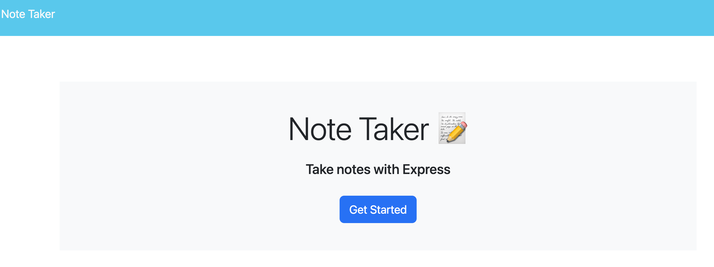
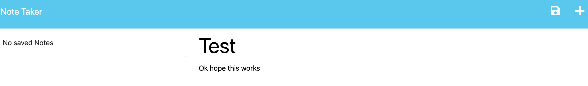
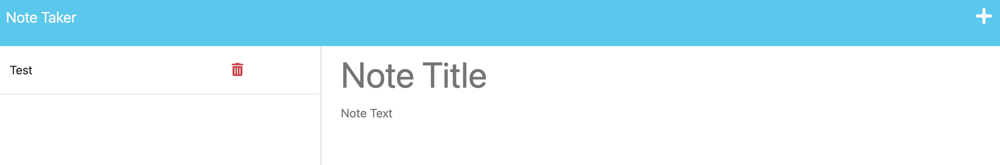

# 11-Express.js-Note-Taker

## Description
The purpose of this project is to build a note taking app using express.js. It was made for a user to keep track of notes they jotted down for future use. Making the code for it help me understand the concept of using Express.js and general understanding of how to structure files so that data can flow between the front end in HTML and the backend in NODE.js.

## Installation
Once you downloaded the file, open the terminal and cd into the correct directory. In terminal enter npm init -y

Afterwards install the required dependencies by typing this into the terminal npm i.

Now you can run the project backend by first running node server.js in the terminal. Next you then go into your browser and enter localhost:3001 into the url address.

You will find the homepage.
 

Once you click started you will see the app
 

To use the app type in the the text boxes in the right.
 

Once you hit the save button on the top right. The note will be on the left.
 

If you click on the note on the left, the note contents will show up on the right.
 

Finally when you want to go back to writing a new note, just click the + button on the top right to resume.
 
You will go back to to resume note taking.
 

## Usage
You can use the project to see how a project is structered and how information flows using Express.js. Also its a handy tool to jot down notes for personal use.

## Credits
For this project I used the starter code and code from the mini prohect in Week 11-Express to structure the project and help fulfill the functionality of the note taking app such as the routes and the file stream utilities. Please note that due to time constraints I was unable to complete the optional delete functionality.
